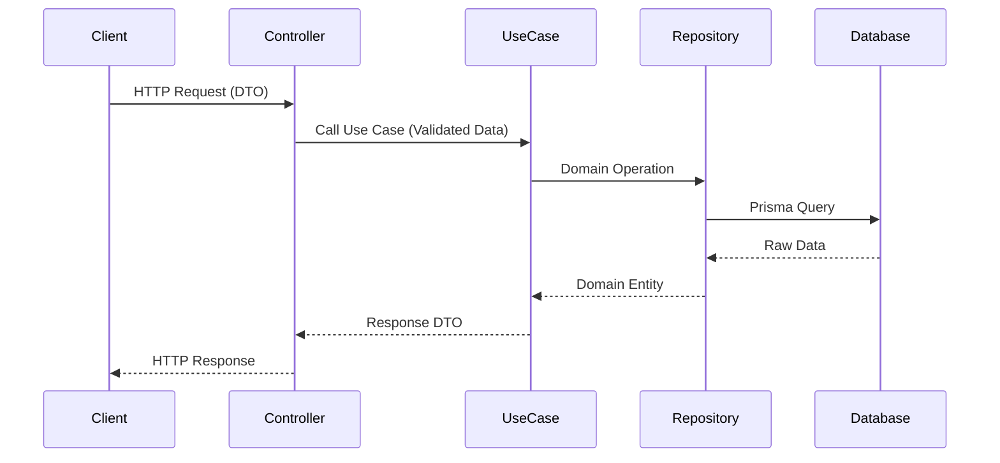

# Backend Architecture

## Overview
The backend is built with NestJS, serving as a dedicated API layer separated from the Next.js shell. It follows Domain-Driven Design (DDD) principles to ensure scalability and maintainability.

## Technology Stack
- **Framework:** NestJS
- **Language:** TypeScript
- **ORM:** Prisma
- **Database:** PostgreSQL (Primary) + Redis (Cache)

## Domain-Driven Design (DDD) Structure
The API is divided into domain modules. Each module is self-contained.

```
src/modules/
├── auth/
│   ├── domain/        # Entities, Interfaces
│   ├── application/   # Use cases, DTOs
│   └── infrastructure/# Repositories, Controllers, Module definitions
├── users/
└── preferences/
```

## Data Flow


## SOLID Principles
- **SRP:** Controllers handle routing; Use Cases handle business logic.
- **OCP:** Use interfaces for services like Email or Storage to allow swapping implementations.
- **LSP:** Repository interfaces ensure database implementations can be replaced.
- **ISP:** Keep interfaces small (e.g., `IUserReader`, `IUserWriter`).
- **DIP:** Inject interfaces into constructors, not concrete classes.
