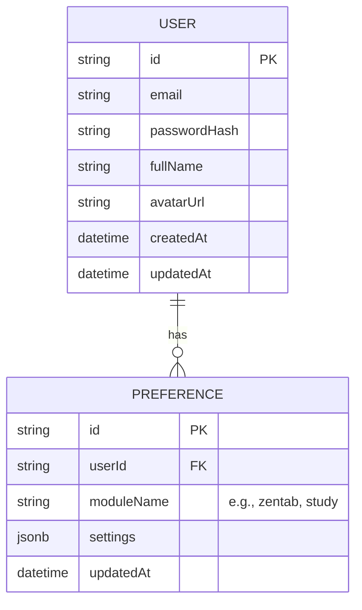

# Database Schema

## Overview
The platform uses PostgreSQL as the primary database managed via Prisma ORM.

## Entity Relationship Diagram (ERD)



## Prisma Schema (Overview)
```prisma
model User {
  id           String       @id @default(uuid())
  email        String       @unique
  passwordHash String
  fullName     String?
  avatarUrl    String?
  createdAt    DateTime     @default(now())
  updatedAt    DateTime     @updatedAt
  preferences  Preference[]
}

model Preference {
  id         String   @id @default(uuid())
  userId     String
  moduleName String
  settings   Json
  updatedAt  DateTime @updatedAt

  user User @relation(fields: [userId], references: [id], onDelete: Cascade)

  @@unique([userId, moduleName])
}
```
