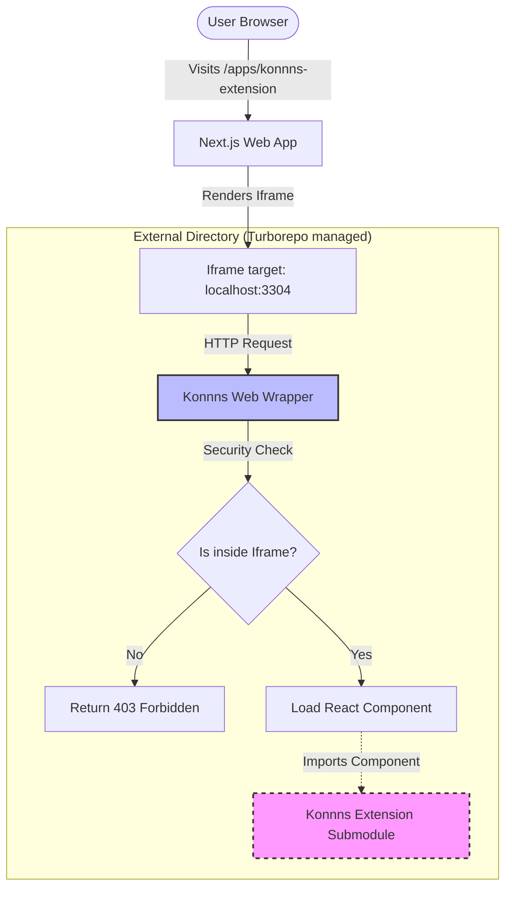

# External Submodules Architecture

## Overview
RiikonCenter integrates external tools and extensions (developed by RiikonTeam or third parties) as Git Submodules. To maintain the integrity of these external repositories, we strictly follow the **Wrapper Mode Architecture**.

## Wrapper Mode Architecture
The core principle is: **Never modify the source code of an external submodule to fit the host platform.**

Instead of injecting host-specific configurations (like Vite configs, Webpack configs, or authentication blocking scripts) directly into the submodule, we create a parallel "Wrapper Application".

### Directory Structure
```text
riikoncenter/
├── apps/                 # Core applications (Next.js, NestJS)
├── packages/             # Shared internal libraries (UI, Config)
└── external/             # External Integrations
    └── integration-[name]/
        ├── [name]-extension/ # (Pristine Submodule) The raw source code of the extension
        └── wrapper/          # (Wrapper App) The host-specific Vite app
```

## System Interaction Flow



## Implementation Rules
1. **Submodule Integrity:** The submodule folder (`external/[name]`) must remain clean. No new files, no package.json edits, no script modifications.
2. **Wrapper Responsibility:** 
   - Compiling the submodule's source code for the web using its own bundler (Vite).
   - Enforcing platform-specific security (e.g., blocking direct browser access outside the RiikonCenter Iframe).
3. **Turborepo Optimization:** If the submodule has its own scripts that conflict with the global workspace (e.g., a `dev` script that spawns a browser extension process), it must be explicitly filtered out in the root `package.json` (e.g., `turbo run dev --filter=!konnn-extension`).
