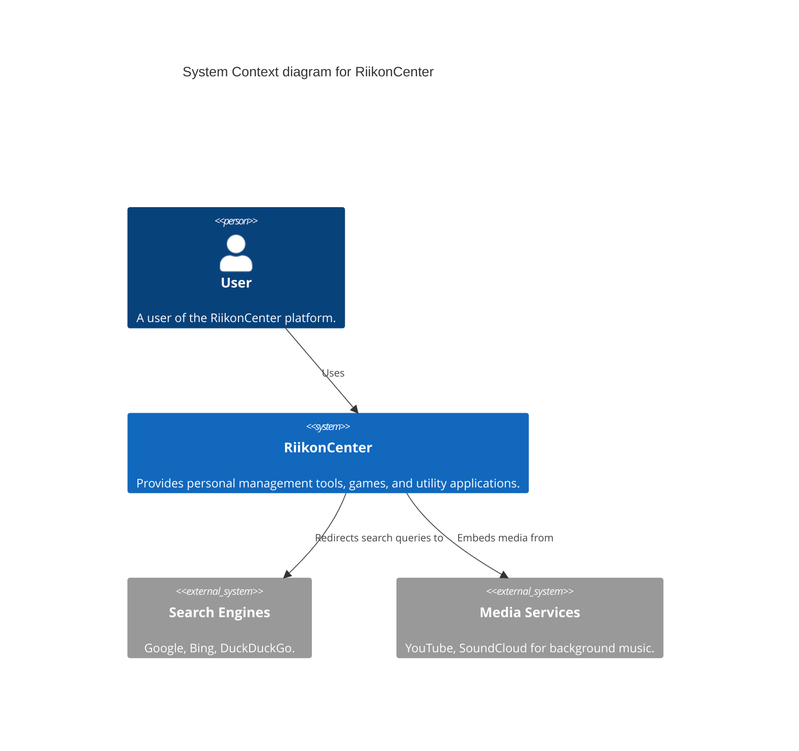
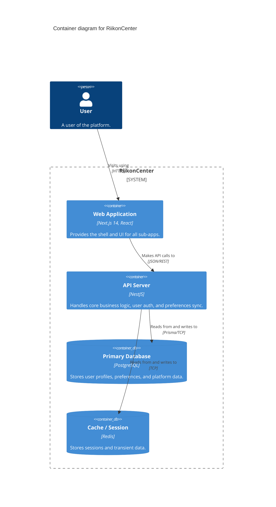

# System Design

## Overview
RiikonCenter is a Multi-Purpose Web Platform consisting of multiple applications under a single ecosystem. It includes personal management tools (ZenTab, Study With Me), Webgames, and Standalone Utilities.

## C4 Model Diagrams

### 1. System Context Diagram

### 2. Container Diagram

